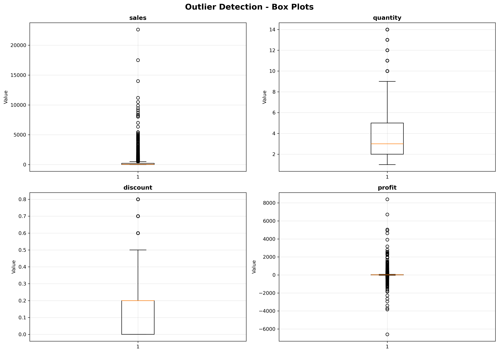

# 📸 Simple Screenshot Instructions

Follow these 5 easy steps to capture all necessary screenshots:

---

## Step 1: Terminal Output (Most Important!)

**Run this command:**
```bash
python run_notebook_with_outputs.py
```

**What you'll see:**
- Complete data cleaning process
- All 13 steps with outputs
- Statistics and results

**How to screenshot:**
1. Make terminal full screen
2. Press `Windows + Shift + S` (or use Snipping Tool)
3. Capture the entire output
4. Save as `screenshots/cleaning_output.png`

**Why this matters:** Shows your complete data cleaning workflow

---

## Step 2: Before vs After Comparison

**Run this command:**
```bash
python view_results.py
```

**What you'll see:**
- Original dataset preview
- Cleaned dataset preview  
- Comparison table
- Outlier summary

**How to screenshot:**
1. Scroll to the "COMPARISON SUMMARY" section
2. Capture that entire section
3. Save as `screenshots/before_after_comparison.png`

**Why this matters:** Demonstrates the impact of your cleaning

---

## Step 3: Check the Box Plot (Already Done!)

**Location:** `screenshots/outlier_boxplots.png`

**What it shows:**
- Visual outlier detection
- 4 box plots for numerical columns

✅ **This is already generated - no action needed!**

**Why this matters:** Visual proof of outlier analysis

---

## Step 4: Project Structure

**How to do it:**
1. Open File Explorer
2. Navigate to `SCT_DA_2` folder
3. Expand these folders:
   - Dataset (show raw/ and cleaned/)
   - notebooks
   - src
   - reports
   - screenshots
4. Take screenshot showing all files
5. Save as `screenshots/project_structure.png`

**Why this matters:** Shows professional project organization

---

## Step 5: Open the Cleaned Data in Excel/Notepad (Optional)

**How to do it:**
1. Navigate to `Dataset/cleaned/Global_Superstore_Cleaned.csv`
2. Open in Excel or notepad
3. Show the first few rows
4. Highlight the clean column names
5. Save as `screenshots/cleaned_data_excel.png`

**Why this matters:** Visual proof of clean, formatted data

---

## 🎯 Priority Order

If you're short on time, capture these in order:

1. ✅ **Must Have**: Terminal output (`run_notebook_with_outputs.py`)
2. ✅ **Must Have**: Box plots (already generated!)
3. ✅ **Recommended**: Before/After comparison (`view_results.py`)
4. ⭐ **Nice to Have**: Project structure
5. ⭐ **Nice to Have**: Excel view of cleaned data

---

## 🖼️ Screenshot Settings

**For best quality:**
- Resolution: 1920x1080 or higher
- Format: PNG (better quality than JPG)
- Zoom: 100% (readable text)

**Windows shortcuts:**
- `Windows + Shift + S` - Snipping Tool
- `Windows + Print Screen` - Full screen
- `Alt + Print Screen` - Active window

---

## ✅ Checklist

- [ ] Screenshot 1: Terminal cleaning output
- [ ] Screenshot 2: Before/After comparison  
- [ ] Screenshot 3: Box plots (already done!)
- [ ] Screenshot 4: Project structure
- [ ] Screenshot 5: Excel view (optional)

---

## 📂 Where to Save

Save all screenshots in: `screenshots/` folder

Suggested file names:
- `cleaning_output.png`
- `before_after_comparison.png`
- `outlier_boxplots.png` (already there!)
- `project_structure.png`
- `cleaned_data_excel.png`

---

## 🚀 Quick Commands Summary

```bash
# 1. Generate all notebook outputs
python run_notebook_with_outputs.py

# 2. View before/after comparison
python view_results.py

# 3. Check if box plots exist
dir screenshots
```

---

## 💡 Pro Tips

1. **Clean terminal**: Run `cls` before running commands for cleaner output
2. **Full screen**: Make terminal full screen for better screenshots
3. **Multiple shots**: Take a few screenshots of each, choose the best one
4. **Zoom**: Use Ctrl++ to zoom in if text is too small
5. **Context**: Include the command you ran at the top of terminal

---

## ❓ Common Issues

**Q: Terminal output too long?**
- Scroll to the top and take multiple screenshots, then combine them

**Q: Text too small?**
- Zoom in with Ctrl++ before taking screenshot

**Q: Box plot not generated?**
- It should be there! Check `screenshots/outlier_boxplots.png`

---

## ✨ You're Done!

Once you have 3-5 screenshots:
1. Put them in the `screenshots/` folder
2. Add them to your README if posting to GitHub
3. Include them in your presentation/report

**Your project is now fully documented and ready for submission!** 🎉

---

## 📋 Example README Screenshot Section

You can add this to your README.md:

```markdown
## Screenshots

### Data Cleaning Process


### Before vs After


### Outlier Detection


### Project Structure

```

---

**That's it! Happy screenshotting!** 📸✨
